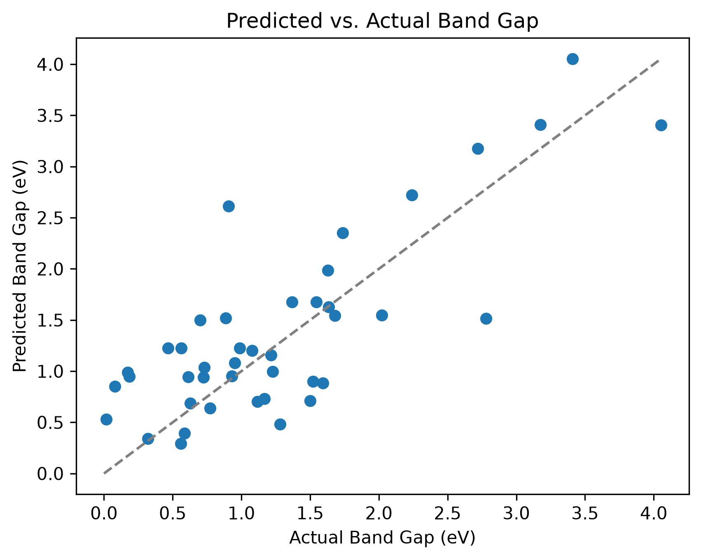
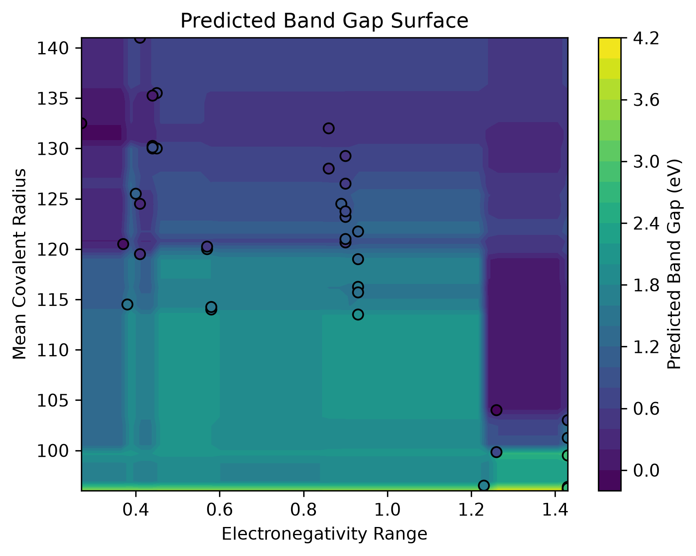
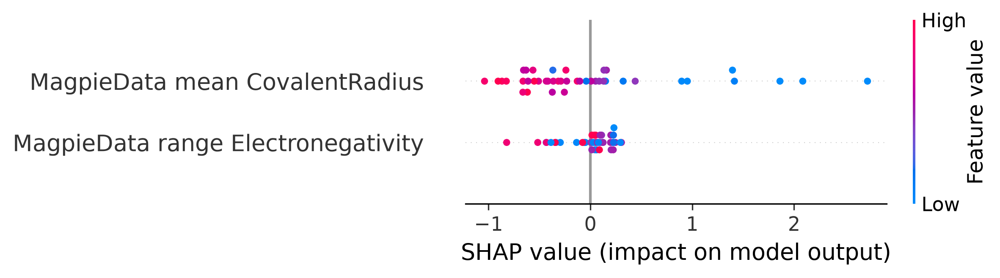

Semiconductor Bandgap Prediction ML Model to predict DFT-computed bandgap for group III-V/II-VI zinc-blende semiconductors from composition

    About the Project:
This project began with the intention to learn more about the design of machine learning algorithms and their application in the research of semiconductor band gaps and their relationships with elemental properties. Using only elementary properties and compositions, I seek to create an algorithm that predicts DFT (Density Functional Theory) bandgap with input III-V/II-VI zinc-blende semiconductors.

This project was limited in scope to focus on III-V/II-VI zinc-blende structures to study structures and compositions I was already familiar with while maintaining compositions that are incredibly important to semiconductor mechanics. Notable semiconductor elements, such as group IV elements (like silicon) or transition metals were excluded due to different bonding logic and complexity outside the trends I am researching.

The trends I would be following are well-documented to allow cross-reference for my results to verify the validity of my algorithm. I predict the data will indicate a strong negative correlation between mean atomic radius and band gap and a strong positive correlation between electronegativity range and band gap.

    Data Selection:
Data for this project was sourced using Materials Project, where information for 42 different binary and ternary III-V/II-VI zinc-blende semiconductors was collected using an API.

Data was very selectively collected, targetting thermodynamically stable compositions with energy above hull values of less than 0.05 eV/atom and relevant band gaps between 0.01 and 6 eV (excluding conductive materials at 0 eV). Following these parameters, a large dataset was collected, however many compositions (especially Zinc Sulfide) had a significant amount of polytypes, which were reduced to the most thermally stable version to remove the problem of having multiple outputs for the same compositional input.

    Featurization:
In order to transform raw data into usable metric for relationship-forming, featurization must be used to numerically identify the compositions in the dataset. I followed the general rule is to have one feature for every 10-20 data points, selecting 2-3 features for my data. Due to the focus on composition, the selection of features was fairly limited, as many properties ended up redundant with elemental properties naturally being very interconnected. Relevant features of atomic radius and electronegativity were chosen.
    
    Known Limitations:
The first and most significant limitation is the chosen scope resulting in a fairly low dataset to work off of, making it difficult to form relationships and risks overfitting of ML models. The data itself was also limited by the use of PBE-DFT band gaps, which are always underestimated and may have showed small gap semiconductors as 0 eV, excluding them from the bandgap min of 0.01. Also, with the chosen focus on purely compositional elements, data only had two significant and non-redunant features to use with the Magpie presets, radius and electronegativity.

Upon analyzing the results, the underrepresentation of some elements, particularly Indium, as a result of the underestimated DFT band gaps caused a significant data gap and inaccurate predicitons. Of the 20 worse-predicted compounds by absolute error, 9 compositions included Indium. As a result, the model has a significant limitation in prediction of Indium binary and ternary compositions.

    Project Structure:
semiconductor-bandgap-ml/
├── data/
│   ├── raw/            # untouched pulls from Materials Project
│   └── processed/      # featurized, model-ready data
├── figures/            # saved figures from models
├── src/                # pipeline scripts
├── requirements.txt
└── README.md

    Setup:
1. Clone and Enter Project:
git clone <your-repo-url>
cd semiconductor-bandgap-ml
2. Activate Virtual Environment in PowerShell:
python -m venv venv
venv\Scripts\activate
3. Install Dependencies in Python:
pip install -r requirements.txt
4. Get Materials Project API Key and Set:
$env:MP_API_KEY = "your_key_here"
5. Run Files In Order:
pull_data.py
featurizedata.py
modelgen.py*
*In modelgen, the outputs are controlled by commented out sections on the bottom, and can be selectively activated by removing the hashes.

    Results:
As a whole, this project has been incredibly interesting and a great chance for me to discover more about semiconductor mechanics and machine learning algorithms. Researching machine learning fundamentals and applying them to material science has given me a great look into material research and the use of raw data and technology to make conclusions.

For the algorithm itself, three models were created between the dummy, standard linear regression, and XGBoost. Compared to the dummy model's 0.695 eV, both the linear regression and XGBoost models showed significant improvement with 0.509 ± 0.446 eV MAE and 0.459 ± 0.347 eV MAE respectively, beating baseline by 27-34% error reduction. Although the real models were not statistically meaningfully different based on these values, upon analysis of their actual vs predicted value charts, XGBoost showed significant superiority by accurately predicting high-band-gap compounds (like AlN) while linear regression plateaus. This indicates that there is a likely high nonlinear relationship at extremes that a linear fit cannot capture.

Upon graphical analysis of the XGBoost model, my predicted trends of positive electronegativity range-band gap and negative mean radius-band gap held true. The graph largely followed logical relationships and held very accurate to the sections surrounding real data points (which naturally grouped due to elemental properties). In sections of extreme electronegativity range (<0.4 and >1.2), less real data points were observed, making these predictions less reliable and causing significant extrapolations that are likely not entirely accurate, although may show interesting theoretical trends if compositions in these ranges exist.

Upon SHAP Anaylsis of the XGBoost model, mean covalent radius was a more significant feature than difference in electronegativity, which was very interesting. The accepted relationship finds electronegativity to be the most important factor in determining band gap, and while my model found heavy importance in electronegativity for predicting extreme values (like with In3GaN4), it was overall less useful than radius.

In residual/error analysis, the error between predicted vs actual values for compositions was analyzed and ranked by absolute value. For the top 20 worse-predicted compounds, 9 of them had a clear pattern of including Indium and 19 of them were compositions of Group III-V semiconductors. This can be traced back to the PBE-DFT band gap underestimation limitation from data collection. With the introduction of more data, particularly involving compositions of elements like In, this error would likely be reduced.

In real world model testing using the formula_predict() function, I attempted to use my model with new compositions that were not included in testing data to evaluate its abilities. Successfully, the model was able to identify a material with a near zero bandgap (GaSb) and uncovered more evidence on the Indium limitation by overpredicting on excluded InAs and InSb binaries. Overall, this interactive step helped with uncovering both strong abilities and furthur limitations of the current model.

    Tech Stack:
Language & Environment:
    Python 3
    Virtual environment (venv)
Data Source:
    Materials Project — DFT-computed (PBE) materials database, accessed via mp-api
Core Libraries:
    mp-api — Materials Project API client
    pymatgen — composition parsing, structure/stoichiometry handling
    matminer — composition-based feature engineering (magpie preset)
    pandas / numpy — data manipulation
    scikit-learn — linear regression, cross-validation, baseline dummy model
    xgboost — gradient-boosted tree regression
    shap — model interpretability
    matplotlib — visualization